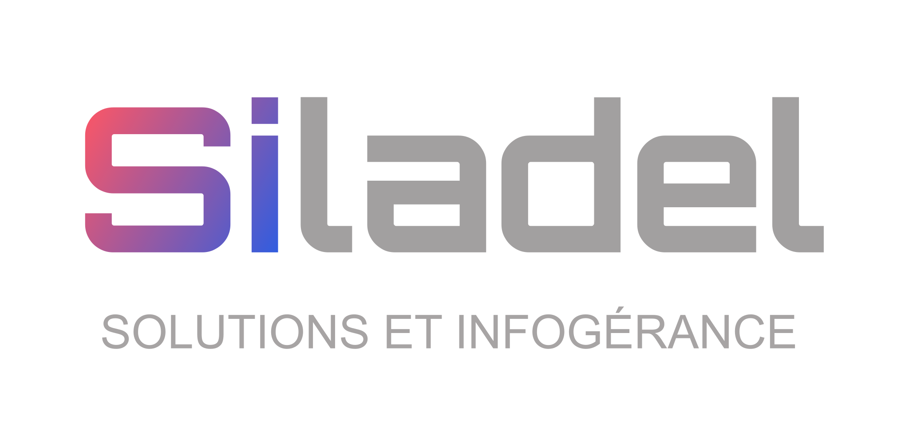

# MediaRelay

Dolibarr module that relays to an **OpenMage/Magento 1** store the images
inserted in the editor of **product and service** cards. These images are
not stored in Dolibarr: they are sent to the store's `media/wysiwyg/`
media library.

## Why it works this way

OpenMage has no API (REST or SOAP) for plain generic images: everything
there is attached to a product. The only place that writes into
`media/wysiwyg/` is the backend's image upload screen (the one used by the
WYSIWYG editor on pages/products), reachable only with a real admin
session, not an API token. The module therefore connects to OpenMage with
a dedicated administrator account instead of a regular API.

## How it works

1. On a product or service card, the description editor gets an **Image**
   button.
2. An image sent (drag & drop, paste, or via that button) goes straight to
   the OpenMage store, not into Dolibarr.
3. The "Browse server" button lets you reuse an image already sent,
   without having to send it again.

## Setup

Home > Setup > Modules > MediaRelay:

- **MEDIARELAY_ADMIN_URL**: base URL of the OpenMage store.
- **MEDIARELAY_ADMIN_USER** / **MEDIARELAY_ADMIN_PASSWORD**: credentials of
  an OpenMage admin account **dedicated** to this integration, never the
  main account. The password is automatically encrypted at rest (standard
  Dolibarr mechanism for `..._PASSWORD` constants).
- **MEDIARELAY_ADMIN_FOLDER**: subfolder of `media/wysiwyg/` to store images
  in (default `uploads`), created automatically if it doesn't exist yet.
  Leave empty to use the `media/wysiwyg/` root directly.
- **MEDIARELAY_CLOUDFLARE_ENABLED** / **MEDIARELAY_CLOUDFLARE_CLIENT_ID** /
  **MEDIARELAY_CLOUDFLARE_CLIENT_SECRET**: only needed if the store's
  `/admin/` is gated by Cloudflare Access (Zero Trust). Without a service
  token, every request is intercepted by Cloudflare's own SSO login before
  it ever reaches OpenMage, and the module can't log in at all. Create a
  dedicated Service Token in Zero Trust > Access > Service Auth and enter
  its Client Id/Secret here. The secret is encrypted at rest the same way
  as MEDIARELAY_ADMIN_PASSWORD.

Once the URL, username and password are saved, a **Test connection** button
appears: it logs in and reaches the configured storage folder exactly like a
real upload would (Cloudflare Access included, if enabled), and reports
success or the precise failure reason - useful to validate the setup without
having to try it from a product card.

## Fixing the encoding of older descriptions

Home > Setup > Modules > MediaRelay > **Fix encoding** tab: detects
product/service descriptions whose text got UTF-8 encoded twice (e.g.
`pensé` instead of `pensé`) - typically a leftover from importing content
out of an older system that used a different editor/charset. This tool is
unrelated to the module's normal operation (which never touches the
description's text, only images): it's a one-off repair of existing data.
Every detected row shows a before/after preview; nothing is changed until
you explicitly apply the fix.

## Files

| File | Role |
|---|---|
| `core/modules/modMediarelay.class.php` | Module descriptor. |
| `class/actions_mediarelay.class.php` | Adds the Image button to the product/service card editor. |
| `upload.php` | Receives sent images and relays them to OpenMage. |
| `browser.php` | "Browse server" popup. |
| `lib/mediarelay.openmageclient.class.php` | Client driving the OpenMage backend. |
| `lib/mediarelay.lib.php` | Admin tabs + double-UTF-8 encoding detection/repair. |
| `admin/setup.php`, `admin/fix_encoding.php`, `admin/about.php` | Setup, encoding-fix and "About" pages. |

---

  

  Developed by <a href="https://www.siladel.fr">SILADEL</a> — Author: IGREJA David

